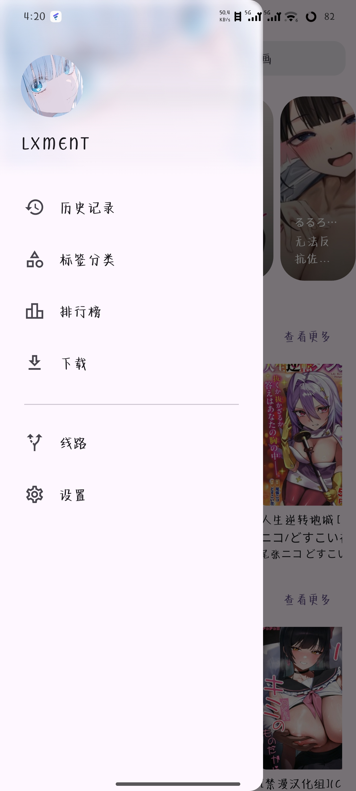

  
  
  
  

## 功能

- 浏览首页推荐、连载更新、排行榜
- 搜索漫画，按标签分类筛选
- 收藏夹
- 漫画详情与章节列表
- 章节阅读器（缩放、翻页、阅读设置）
- 离线下载
- 阅读历史
- 章节评论
- 账号登录
- 深色 / 浅色主题切换（圆形扩散动画）

## 下载

前往 [Releases](https://github.com/LuckyLxi/Hazuki/releases) 下载最新 APK。

## 致谢

- [Venera](https://github.com/venera-app/venera) — 参考了部分实现
- [venera-configs](https://github.com/venera-app/venera-configs) — 使用了 JMComic 漫画源脚本
- [Animeko](https://github.com/open-ani/animeko) — 参考了部分 UI 设计
- [flutter_qjs](https://github.com/ekibun/flutter_qjs)

## 免责声明

本软件以 GPL-3.0 协议开源，免费提供，仅供个人学习与技术交流使用。

Hazuki 本身不托管、存储或分发任何漫画内容。所有内容均通过第三方漫画源脚本动态获取，版权归各自权利人所有。该脚本来自独立的第三方仓库，与本项目无关联，首次启动时由应用自动下载。

账号凭据仅用于与漫画源站点直接通信，本软件不对其进行任何形式的存储或上传。

本软件不对用户的使用行为承担任何责任。请确保您的使用符合所在地区的法律法规，由此产生的一切法律责任由用户自行承担。

## 许可证

[GPL-3.0](LICENSE)
