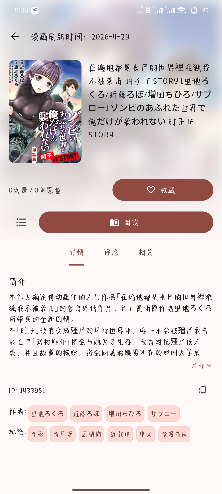

# Hazuki

  
  
  

  免费、开源的 JMComic 第三方 Android 阅读器

---

## 简介

Hazuki 是一个基于 Flutter 的 JMComic 第三方漫画阅读客户端

## 功能

**阅读**
- 支持从右到左（分页）与从上到下（长条）两种阅读模式
- 分区点击翻页，支持捏合缩放，长按图片可保存到本地
- 点击屏幕中间显示/隐藏控制栏，控制栏含可拖动进度条、章节选择、退出按钮
- 阅读设置侧边栏：翻页方向、屏幕常亮、自定义亮度等
- 支持下载漫画离线阅读，可按章节或整本下载，重装后可扫描恢复已下载内容

**发现与搜索**
- 发现页展示站点探索内容，支持排行与分类浏览
- 支持关键词搜索、漫画 ID 直接搜索，支持排序筛选

**账号与数据**
- 账号登录，收藏与漫画账号同步
- 本地历史记录，包含阅读进度（章节级别）
- WebDAV 同步（历史记录、搜索记录、用户设置）

**界面与设置**
- Material 3，支持动态取色与深浅色切换
- 毛玻璃顶部栏，沉浸式视觉体验
- 评论浏览

**隐私保护**
- 任务栏隐藏软件内容（黑屏保护）
- 进入软件时支持生物识别验证（指纹）

## 致谢

- [Venera](https://github.com/venera-app/venera) — 参考了部分实现
- [venera-configs](https://github.com/venera-app/venera-configs) — 使用了 JMComic 漫画源脚本
- [Animeko](https://github.com/open-ani/animeko) — 参考了部分 UI 设计
- [flutter_qjs](https://github.com/ekibun/flutter_qjs)

## 免责声明

本软件免费开源，仅供个人学习与交流使用。

Hazuki 本身不提供、存储或分发任何漫画内容，所有内容均来自第三方漫画源脚本，版权归各自权利人所有。账号密码仅用于与源站直接通信，本软件不作任何存储或上传。

首次启动时软件会自动下载漫画源脚本，该脚本来自第三方仓库，与本项目无关。

请在遵守当地法律法规的前提下使用本软件，由此产生的任何责任由使用者自行承担。

## 许可证

[GPL-3.0](LICENSE)
