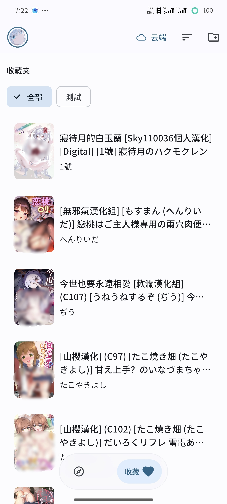
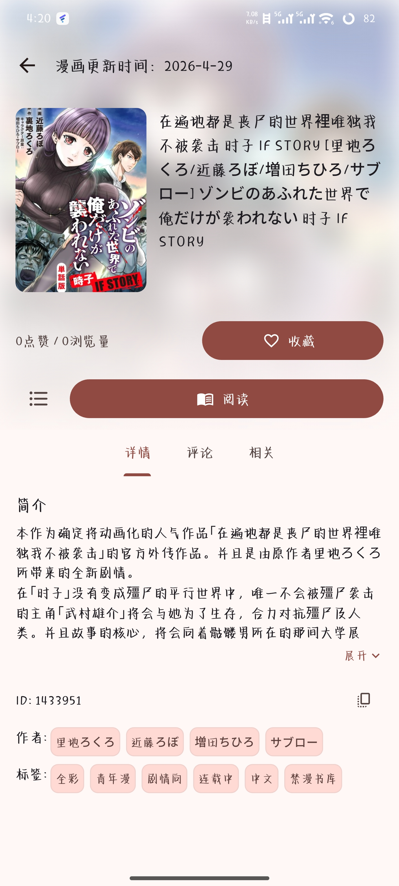
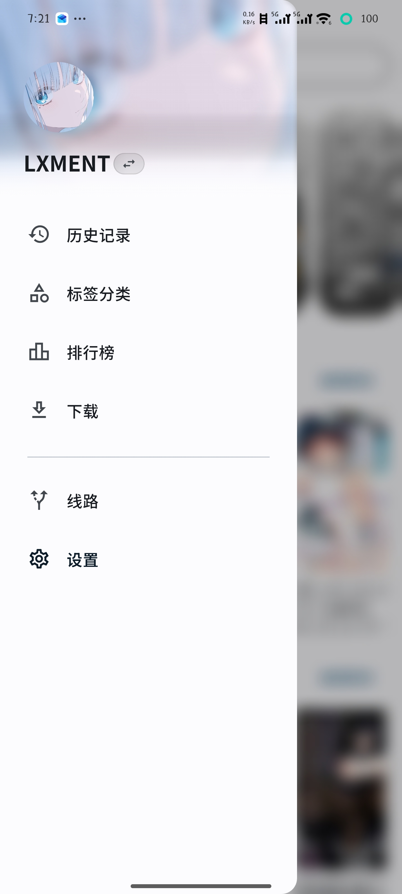

  
  
  
  

## 功能

- 首页推荐
- 发现页
- 排行榜
- 搜索漫画，按标签分类筛选
- 收藏夹
- 下载漫画
- 阅读历史
- 查看/点赞评论
- 账号登录

## 下载

前往 [Releases](https://github.com/LuckyLxi/Hazuki/releases) 下载最新 APK。

## 致谢

- [Venera](https://github.com/venera-app/venera) — 参考了部分实现
- [venera-configs](https://github.com/venera-app/venera-configs) — 使用了漫画源脚本
- [Animeko](https://github.com/open-ani/animeko) — 参考了部分 UI 设计
- [flutter_qjs](https://github.com/ekibun/flutter_qjs)

## 许可证

[GPL-3.0](LICENSE)
